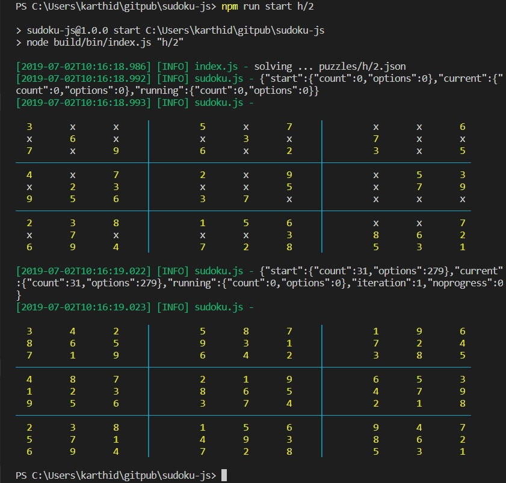

# sudoku-js
A sudoku solver program written in javascript.  This program take sudoku problem and solves the board for easy and medium porblems. 

## Data Structures
Name | Type | Description
------------ | ------------- | -------------
| board | 2D array | <ul><li>numeric value indicates a solved cell</li><li>string values indicates a unsolved cells with available options.</li></ul>
| stat  | object | holds various execution statistics and counts for debuging and logging purposes.

## Reducers
Reducer reduces options from unresolved cells and makes way to solving the board.  As complexity increases, more advanced reducers are required to solve a board.  Here is the list of reducers implemented in this program.

### 1. standard options reducer
It reduces options as per the solved values in containing row, columm and box for a cell.

### 2. naked options reducer
Any repeating options in a row, col or box (2 pairs, 3 tripples) removes those options from rest of the respectie row, col and boxes.

### 3. pointing options reducer
If a row or column of a box contains unique key(s) within the box or entire row or column, those options can be removed from rest of the box or rows or columns.

### 4. hidden options reducer
Any hidden options in a row, col or box removes those options from rest of the respective row, col and boxes.

### 5. x-wing options reducer
any rectangle formed with a single hidden option removes that single hidden option from rectangle's rows and columns.

### 6. unique options reducer
It reduces unique option(s) (one single, two doubles, three tripples etc) from rest of the row, column or box

### 7. sword fish options reducer
It reducess the options from a 3x3 formation aka sword fish formation.

## Execution
There are few puzzles stored as json files under 'e' (easy) or 'm' (medium) or 'h' (ard) directories of puzzle dir. 
Should you need to add a new puzzle add a new n.json file under any of 'e' or 'm' or 'h' dirs with puzzle data.

puzzle id = dir/filename  eg.  e/2, m/1, h/2

```
$ npm run build
$ npm run start  <puzzle id> [, <puzzle id>]
```
### screen-shot


